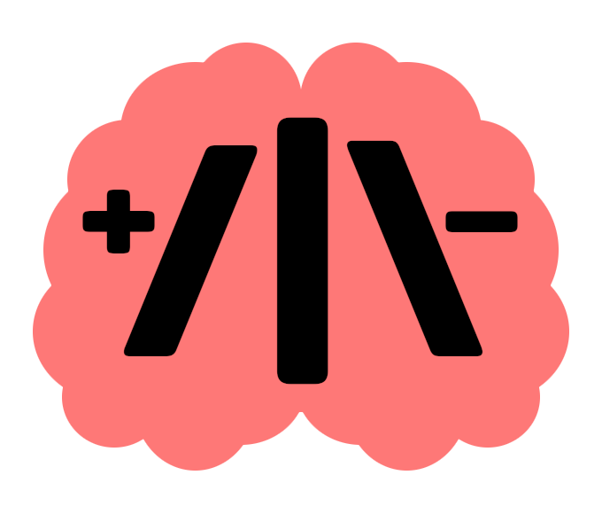

# Stroke+-



**Stroke+-**, also `+{/|\}-`, is an esoteric structured programming language.

With only four instructions, it aims to be the simplest Turing-complete structured programming language possible.

It uses conditional loops and an unbounded number of non-negative integer variables along with manipulation of their values.

Stroke+- is an extension of [Stroke](https://github.com/ttulka/stroke) that is even simpler but at the cost of sacrificing Turing completeness.

## Language

Stroke+- code consists of stroke symbols `/`, `|`, `\`, and arithmetic signs `+`, `-`. 

All other symbols are ignored.

### Instructions

| Instr   | Name       | Meaning |
| ------- | ---------- | ------- |
| `+var` | Increment  | Increments the value of the variable |
| `-var` | Decrement  | Decrements the value of the variable |
| `/var` | Loop start | Enters a new loop if the variable is non-zero |
| `\`     | Loop end   | Jumps back to the matching loop start |

The example code in Stroke+-:

```stroke+-
+ | 
/ | 
  - | 
  + || 
\ 
+ |||
```

can be translated into the following pseudocode:

```
inc var0
while var0
  dec var0
  inc var1
inc var2
```

Optionally, the instruction for output `!` may be implemented.

### Variables

A Stroke+- program runs on a theoretically infinite tape of non-negative integer cells that are randomly accessible via variables denoted by consecutive vertical stroke symbols (`|`) in unary form starting from zero. For instance, `|` refers to the variable indexed by 0, `||` refers to the variable indexed by 1, `|||` refers to the variable indexed by 2, and so on.

## Examples

(White spaces are added only for the sake of readability.)

### Empty program

The simplest program is the empty program:

```stroke+-
```

### Infinite loop

As variable *0* is never reset, the program loops forever:

```stroke+-
+ | / | \
```

### Clear

Sets the value of variable *0* to zero:

```stroke+-
CLR 0:
/ |
  - |
\
```

### Move

Moves the value in variable *0* to *1*:

```stroke+-
MOV 0 1:
/ |
  - |     dec 0
  + ||    inc 1
\
```

### Copy

Copies the value in variable *0* to *1* using *2* as an auxiliary:

```stroke+-
CPY 0 1:
/ |
  - |     dec 0
  + ||    inc 1
  + |||   inc 2
\
/ |||
  - |||   dec 2
  + |     inc 0
\
```

### Add

Adds the values in *0* and *1* to *0*:

```stroke+-
ADD 0 1:
/ ||
  - ||
  + |
\
```

### Conditional branching

Conditional branching (IF) can be simulated via loops:

```stroke+-
IF 0:
CPY 0 2     aux 2
/ ||| 
  / ||| - ||| \  clr aux 2

  do something conditionally...
\
```

### Fibonacci sequence

Computes the Fibonacci sequence in *0* using *1* and *2* as auxiliaries:

```stroke+-
FIB:
+ |||||
/ |||||    forever
  MOV 1 2
  MOV 0 1
  CPY 2 0
  ADD 1 2
\
```

### Hello World

For computing "Hello World" the numeric values must interpreted as a string. 
  It can achieved by defining a binary alphabet:

| Symbol | Binary |
| ------ | ------ |
| ` `    | 000    |
| `d`    | 001    |
| `e`    | 010    |
| `H`    | 011    |
| `l`    | 100    |
| `o`    | 101    |
| `r`    | 110    |
| `W`    | 111    |

The binary number `011010100100101000111101110100001` then corresponds to "Hello World".

To be concise, eight variables can be used and concatenated to represent the output. 
  They must contain values `00011`, `01010`, `01001`, `01000`, `11110`, `11101`, `00001`:

```stroke+-
+ | + | + |
+ || + || + || + || + || + || + || + || + || + ||
+ ||| + ||| + ||| + ||| + ||| + ||| + ||| + ||| + |||
+ |||| + |||| + |||| + |||| + |||| + |||| + |||| + ||||
+ ||||| + ||||| + ||||| + ||||| + ||||| + ||||| + ||||| + ||||| + ||||| + ||||| + ||||| + ||||| + ||||| + ||||| + ||||| + ||||| + ||||| + ||||| + ||||| + ||||| + ||||| + ||||| + ||||| + ||||| + ||||| + ||||| + ||||| + ||||| + ||||| + |||||
+ |||||| + |||||| + |||||| + |||||| + |||||| + |||||| + |||||| + |||||| + |||||| + |||||| + |||||| + |||||| + |||||| + |||||| + |||||| + |||||| + |||||| + |||||| + |||||| + |||||| + |||||| + |||||| + |||||| + |||||| + |||||| + |||||| + |||||| + |||||| + ||||||
+ |||||||
```

## Computational class

Stroke+- is Turing complete according to [the structured program theorem](https://en.wikipedia.org/wiki/Structured_program_theorem), as conditional branching (selection) can easily be simulated via loops.

## JavaScript interpreter

```sh
npm i strokepm
```

```js
const strokepm = require('strokepm')

strokepm('+|/|-|+||\\+|||')  // [0, 1, 1]
```

## License

[MIT](LICENSE)
